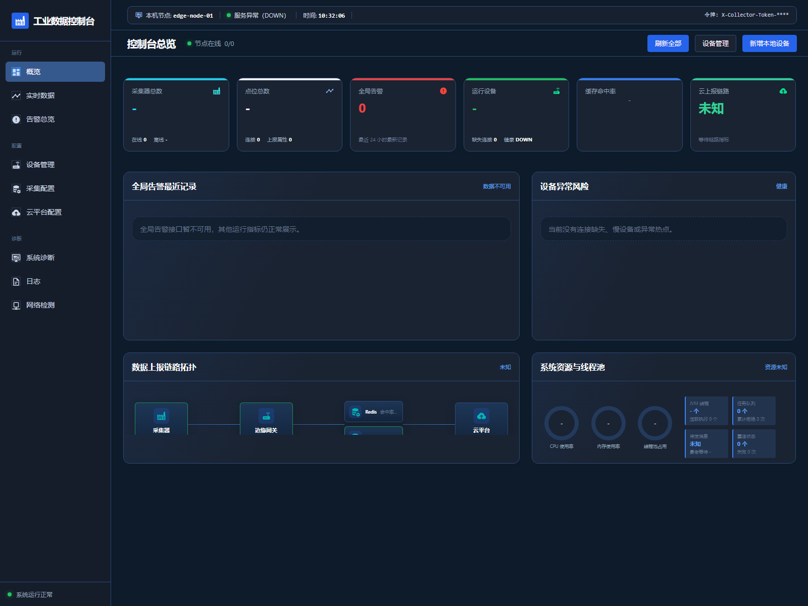
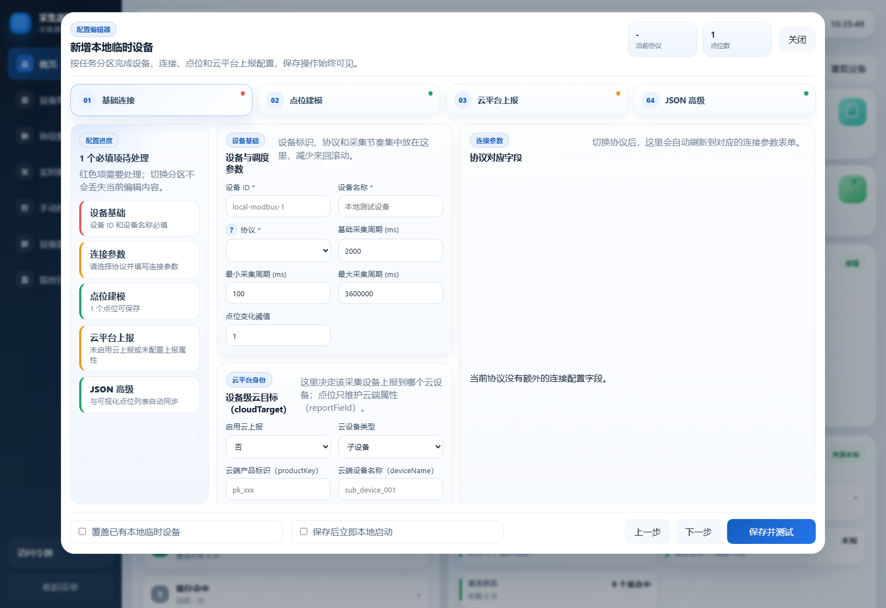
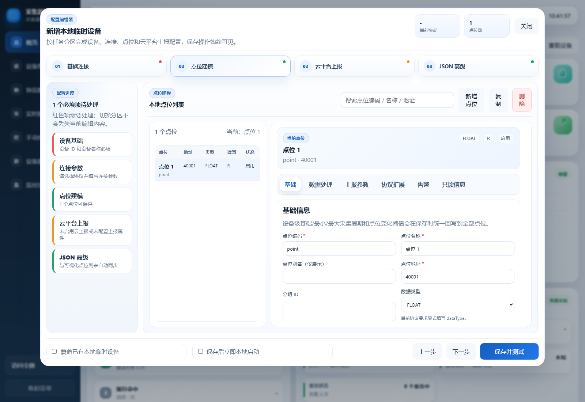
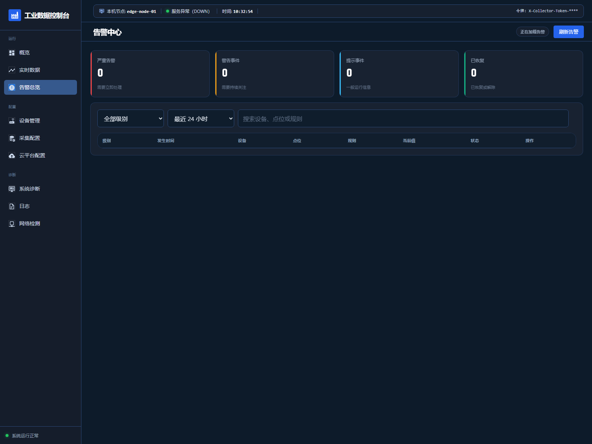
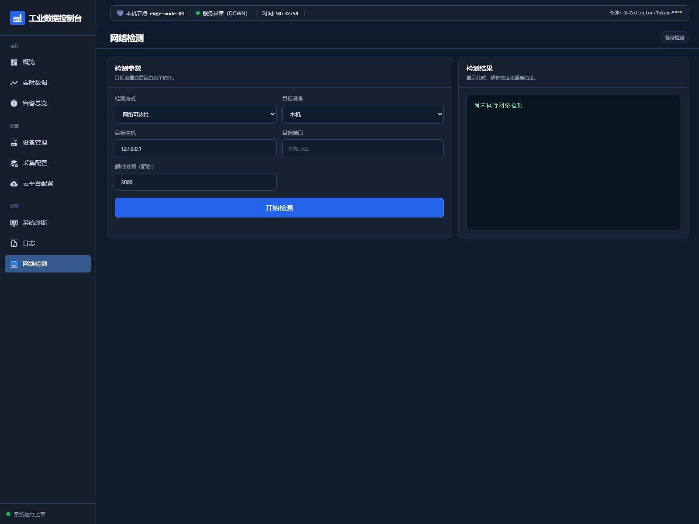

# data-collection-service

面向工业物联网场景的多协议采集网关，基于 `Spring Boot 3.x + Java 17` 构建，覆盖从设备接入、采集调度、数据处理、缓存、实时流、历史存储、云端上报到运行监控的完整链路。

这个仓库不是单一协议，是一个可私有化部署、可持续扩展的采集底座。它的重点不是“把一个点读出来”，而是把工业现场采集做成一个稳定、可治理、可观察的系统。

## 项目定位

本项目适合两类场景：

1. 作为工业现场私有化部署的数据采集网关。
2. 作为工业物联网平台的采集底座进行二次开发。

系统目标：

- 统一多协议采集模型
- 提供可扩展、可观测并经过真实下游链路验证的采集调度能力
- 将设备点位数据统一收敛为标准处理结果
- 支持缓存、实时流、历史存储、云端上报的全链路闭环
- 提供在线配置治理、运行态监控和问题可追踪能力

## 控制台访问

项目内置了静态管理控制台页面。准备好 Java 17 和 Maven 后，可以通过以下命令完成本地构建和启动：

```bash
mvn -B -ntp clean package -DskipTests
java -jar target/data-collection-service-0.0.1-SNAPSHOT.jar --spring.profiles.active=dev
```

应用启动完成后访问：

- 本地默认地址：`http://127.0.0.1:9090/collector/admin/index.html`
- 如果你修改了 `server.port` 或 `server.servlet.context-path`，请按实际配置调整访问地址

首次打开控制台时，按以下步骤完成本地访问和设备配置：

1. 在页面左下角“访问令牌”区域输入开发令牌 `ops-token` 并保存。
2. 打开设备管理区域，点击“新增本地临时设备”。
3. 依次填写设备基础信息、连接参数和云平台身份；不需要上报云端时关闭对应开关。
4. 添加协议点位并检查地址、数据类型、读写类型和采集周期。
5. 保存设备后启动采集，在“实时点位工作台”查看当前值、数据质量和处理耗时。

`ops-token` 仅用于本机开发，不能作为生产令牌。本地临时设备只保存在当前进程内存中，应用重启后会丢失；需要长期保存时，应将配置导出并接入文件配置或远程配置源。Redis、TDengine 和云端 MQTT 的启用方式见[配置说明](#配置说明)。

控制台按“工作台、资产与配置、操作中心、系统运维”分组，提供运行总览、实时数据、告警中心、设备管理、采集配置、云端上报、手动控制、设备影子、系统诊断、系统日志和网络检测 11 个入口。页面使用真实接口，不包含墨刀原型中的随机设备、随机告警或随机网络结果。

控制台前端资源位置：

- `src/main/resources/static/admin/index.html`
- `src/main/resources/static/admin/app.js`
- `src/main/resources/static/admin/styles.css`
- `src/main/resources/static/admin/modao-console.js`
- `src/main/resources/static/admin/modao-console.css`
- `src/main/resources/static/admin/icons/`

## 界面预览

### 运行概览



### 本地设备基础配置



### 点位建模



### 告警中心



### 网络检测



## 项目优势

这个工程的优势不在“读一个寄存器”，而在于同时解决以下问题：

- 多协议、多厂商设备并存
- 点位规模大、刷新周期不一致
- 协议层返回结构不统一
- 采集后还要做统一处理、统一缓存、统一上报
- 配置需要在线变更，并且要能安全重载
- 现场问题需要通过指标、日志和健康检查快速定位

项目当前体现出来的工程化能力包括：

- 多协议统一工厂与生命周期管理
- 时间片调度、批次规划、协议读计划构建
- `ProcessResult` 统一结果对象
- 本地缓存、Redis 缓存、Redis Stream、历史存储、云端上报的闭环链路
- 配置治理、差异诊断、导入导出、手动同步
- 健康检查、性能监控、访问日志治理

从架构上看，它是“采集协议框架 + 调度系统 + 数据处理总线 + 运维治理层”的组合。

## 性能与容量验证

截至 2026-08-13，项目已经完成一轮面向真实 Redis + TDengine 下游链路的固定节奏容量验证。下面的数据是 **当前代码、当前测试环境和当前测试边界下的实测基线**，不是理论值，也不应直接解释为所有生产现场的 SLA。

### 测试边界

- Java 17（本轮 soak JVM 为 17.0.15），`RealEnvironmentSoakIT` 固定节奏 Runtime 场景；测试 JVM `availableProcessors=16`，max heap 约 8.1 GiB。
- Redis `7.4.6`。
- TDengine `3.4.0.0.community`，时间精度 `ms`。
- TDengine 默认写入模式：`DIRECT_REST`，即通过 `TAOS-RS` DataSource + JDBC `Statement` 直接执行单表 multi-values INSERT；MyBatis 写路径保留为可切换兼容模式，但不是当前性能基线默认路径。
- Redis Stream 开启，采用有界 `StreamWriteBuffer` + 独立 writer + Redis pipeline；一条 telemetry 仍对应一条 Redis Stream entry。
- 历史写入开启，采用 `HistoryBatchWriter` 批写、同 subtable single-flight、有界同表 batch merge、Redis fallback/replay。
- Fixed Capacity 场景强制 `collector.adaptive-collection.enabled=false`，并校验实际采集速率与理论速率偏差不超过 ±5%。
- 正式统计采用 `setup -> warmup -> quiescence -> measurement -> drain -> shutdown`，容量 measurement 为 300 秒，warmup/drain 不混入正式吞吐。
- **Cloud/MQTT 上报关闭**。当前结果还没有覆盖完整 Cloud ACK、真实 PLC/OPC UA/S7 网络抖动、长时间 8h/24h soak，因此不能把下面的数值直接作为最终生产 SLA。

### Clean 判定

一次容量运行只有同时满足下面条件，才记为 clean：

- load profile 有效，实际 collector rate 在理论值 ±5% 内；
- Entry 无 rejected/drop；
- Stream 无 uncompensated drop，Redis XADD failure 为 0，结束时 Stream buffer 清空；
- History 无 deferred，flush rejected 为 0，Redis pending/processing/local 最终归零；
- collector、pipeline、TDengine 写入速率能够长期跟随，不存在持续增长的 backlog；
- 没有 unknown silent loss。

### 全链路实测结果

| 场景 | 负载 | Collector | Pipeline | TDengine | Stream / Entry / History | 结论 |
| --- | ---: | ---: | ---: | ---: | --- | --- |
| R2 | 10,000 点 / 10s，理论 1,000 points/s | 约 964.7/s | 约 964.7/s | 约 964.7/s | rejected/drop/deferred/pending 均为 0 | clean |
| R1 | 10,000 点 / 5s，理论 2,000 points/s | 约 1,926.9/s | 约 1,926.9/s | 约 1,921.5/s | Stream drop=0，Entry rejected=0，History deferred/pending/rejected=0 | clean |
| R1 repeat | 同 R1 | 约 1,928.8/s | 约 1,928.8/s | 约 1,928.8/s | Stream drop=0，Entry rejected=0，History deferred/pending/rejected=0 | clean |
| R3 边界 | 目标约 2,500 points/s，实测约 2,450 points/s | 能接近目标 | 能接近目标 | 存在尾延迟放大 | 重复运行会出现 History fallback / flush reject | **非稳定 clean 容量** |

因此，当前已重复验证的 **全链路 clean stable 基线约为 1,930 points/s**（真实 Redis + TDengine、Cloud disabled、Fixed Runtime）。这个数字用于说明当前代码已经验证到什么程度，不代表建议把生产长期负载配置在 1,930 points/s。最终生产持续负载和安全余量要在 `4C Production Readiness & Stability Validation` 的 8h/24h 长稳态、故障恢复和 Cloud-enabled 验证完成后再确定。

### 关键性能优化结果

- **History TDengine 写入**：默认从 MyBatis 参数化写路径切换到 `DIRECT_REST`。在 clustered 2,000 rows/s isolated benchmark 中，DB execute P95 从 MyBatis REST 约 `769 ms` 降到 Direct REST 约 `46 ms`；Direct REST isolated 2,500 rows/s 也能 clean。
- **History 批形成**：修复 timer 每次扫描都提前 flush 未满 bucket 的问题；当前默认 `batchSize=50`、最大等待 `flushInterval=300ms`，正式 R1/R2 中主要由 size-trigger 形成满批。
- **History 恢复**：Redis pending replay 从旧的逐条写库、理论约 `66.7 rows/s`，改为 batch replay；20,000 条 pending 的实测恢复约 `500+ rows/s`，并保留 at-least-once ownership、processing、dead-letter 和本地有界 fallback。
- **Redis Stream**：从“stage task 内同步 XADD”改为 bounded admission + 独立 writer + Redis pipeline。isolated benchmark 已验证约 `3,000 rows/s` 时 drop=0、XADD failure=0；因此 R3 的首要限制已经不在 Stream。
- **R3 边界定位**：约 2,500 points/s 下，真实 flush executor queue 并没有打满；失败时是 TDengine burst tail latency 上升，使逻辑 outstanding rows 达到有界上限。重复 R3 中 DB execute P95/P99 可升到约 `1~1.7s / 2.3~3.1s`，1 秒 burst 可达到 `5,150~8,250`，因此目前不建议把 2,500 points/s 宣称为稳定容量。

### 如何理解这些数字

- `1,930 points/s` 是**当前测试边界下重复通过的 clean baseline**。
- `2,500 points/s` 是**当前容量边界探索值**，不是稳定 SLA。
- 早期 synthetic 10k/50k/100k 的极高内存基准不能代表真实 Redis + TDengine 全链路容量，README 不再用 synthetic throughput 作为生产能力宣传。
- CPU、Heap、GC、数据库尾延迟都受测试机器、JVM、Redis/TDengine部署方式和真实协议流量形态影响，应通过相同 soak 脚本在目标部署环境重新建立基线。

## 核心能力

### 1. 多协议采集

当前已纳入统一工厂与生命周期管理的协议：

- `MODBUS_TCP`
- `MODBUS_RTU`
- `MODBUS_ASCII`（作为 `MODBUS_RTU` 兼容接入）
- `SIEMENS_S7`
- `MITSUBISHI_MC`
- `OMRON_FINS`
- `ETHERNET_IP`
- `ADS`
- `KNXNET_IP`
- `OPC_UA`
- `OPC_UA_PLC4X`
- `OPC_UA_MILO`（实验性独立驱动）
- `OPC_DA`
- `BACNET_IP`
- `BACNET_MSTP`
- `BACNET_SC`
- `IEC104`
- `DLT645_2007`（实验性）
- `IEC101`（实验性非平衡控制站）
- `IEC61850`
- `MQTT`
- `SNMP`
- `COAP`
- `HTTP`
- `WEBSOCKET`
- `CUSTOM_TCP`（实验性可配置请求响应数据面）
- `CUSTOM_UDP`（实验性独立 UDP 数据面）

另外，统一协议工厂还兼容以下别名或安全变体：

- `HTTPS`
- `MQTT_SSL`
- `COAP_SSL`
- `WEBSOCKET_SSL`
- `SNMP_V1` / `SNMP_V2C` / `SNMP_V3`
- `S7` / `MC` / `FINS` / `BACNET` 等别名

协议能力特征：

- `Modbus`：支持 TCP / RTU / ASCII，支持读计划、连续地址聚合读取、批量分块写
- `Siemens S7`：支持 `DB` / `I` / `Q` / `M` 等地址形式，支持读、写和订阅
- `Mitsubishi MC`：当前已落地自研 `MC 3E Binary over TCP` 采集链路，支持轮询读写
- `OMRON FINS`：已支持 `FINS/UDP` 读写与连续块合并读取
- `EtherNet/IP`：支持 `Logix Tag` 风格符号地址读写
- `ADS`：支持 `Beckhoff ADS / AMS` 符号读写与订阅
- `KNXnet/IP`：支持组地址采集，支持 `DPT` 类型映射
- `OPC_UA`：默认使用 PLC4X，支持标量和一维数组读写、浏览及标量订阅
- `OPC_UA_PLC4X`：作为兼容别名保留，沿用 `OPC_UA` 主实现
- `OPC_UA_MILO`：显式选择 Eclipse Milo 独立客户端，当前保持实验状态，不会与 PLC4X 混用连接
- `OPC_DA`：支持 `HTTP` 桥接模式与 `INMEMORY` 模式
- `BACnet`：已覆盖 `IP`、`MS/TP`、`SC` 三类接入形态，支持读写与订阅；其中 `BACNET_SC` 当前按实验性能力提供
- `IEC104`：支持读、总召唤、命令下发、单点召唤
- `DLT645_2007`：支持串口多表、数据读取、后续帧、BCD 等值解析和受控写入
- `IEC101`：支持非平衡链路、一级/二级数据、总召唤、时钟同步和遥控
- `IEC61850`：支持模型加载、读写、报告处理
- `MQTT`：支持主题订阅、发布、消息映射，兼容 `MQTT_SSL`
- `SNMP`：支持 GET/SET/WALK，兼容 `SNMP_V1` / `SNMP_V2C` / `SNMP_V3`
- `COAP`：支持 GET/POST/PUT/DELETE/Observe，兼容 `COAP_SSL`
- `HTTP`：支持请求-响应采集，兼容 `HTTPS`
- `WEBSOCKET`：支持消息解析、认证、心跳与缓存回填，兼容 `WEBSOCKET_SSL`
- `CUSTOM_TCP` / `CUSTOM_UDP`：支持受控模板、帧边界和字节/位/JSON 路径解析，仍需按实际厂商协议联调验收

协议文档入口：

- [协议索引](./docs/protocols/README.md)
- [协议字段汇总](./docs/protocols/FIELD_CONFIG_SUMMARY.md)

### 2. 统一调度模型

调度不是简单定时轮询，而是“时间片 + 批次 + 异步处理”的组合模型：

- 设备启动时生成批次并分配到时间片
- 时间片由独立调度器固定频率触发
- 批次采集与数据处理使用不同线程池解耦
- 支持动态时间片调整
- 支持点位自适应采集频率
- 支持协议级 `ReadPlan` 构建，降低请求次数

这使它更适合多设备、大点位、混合刷新频率的现场环境。

### 3. 统一数据处理

所有协议采集结果最终统一落到 `ProcessResult`：

- 原始值类型转换
- 缩放、偏移、布尔/数值转换
- 数据质量判定
- 结果封装与缓存

这意味着协议层只负责“拿数据”，后续缓存、实时流、历史存储和上报都基于同一个标准结果对象。

### 4. 多级缓存

采集结果会进入统一缓存链路：

- 本地缓存
- Redis 缓存
- 设备影子聚合

对应核心组件：

- `MultiLevelCacheManager`
- `LocalCacheManager`
- `RedisCacheManager`
- `ShadowManager`

### 5. Redis Stream 实时流

项目已经把“处理后的采集结果实时写入 Redis Stream”作为正式能力接入主链路。当前写入链路不是在 Stream stage worker 中同步执行单条 XADD，而是通过有界 admission buffer 与 Redis 网络 I/O 解耦：

`StreamTelemetryPostProcessStage -> StreamWriteBuffer -> telemetryStreamWriteExecutor -> Redis pipeline XADD`

特点：

- 写入的是处理后的结果，不是裸原始值
- `StreamWriteBuffer` 使用固定容量，避免通过无界内存吸收下游故障
- writer 按批次 drain 并通过 Redis pipeline 执行 XADD；仍保持 `1 telemetry = 1 Stream entry`
- 原 Stream stage executor 被拒绝时，可直接尝试进入同一个 buffer；只有 buffer 满或关闭时才记为真正 uncompensated/drop
- Redis pipeline 失败会显式计入失败指标，不会把 best-effort 丢失伪装成成功
- 支持两种保留模式：
  - `COUNT`：保留最近 N 条
  - `TIME`：保留最近 N 秒
- `TIME` 模式通过 `XTRIM MINID` 实现时间窗口裁剪

Stream 分支仍是 **best-effort 实时流**，不是 History 那样的持久可靠队列；需要跨故障可靠恢复的数据应使用 History/Outbox 等可靠链路。

### 6. 历史存储

项目已支持将 `ProcessResult` 持久化到 TDengine。当前默认写入链路为：

`HistoryTelemetryPostProcessStage -> HistoryBatchWriter -> TimeSeriesService -> DirectJdbcTdengineTelemetryWriter -> TAOS-RS`

主要能力：

- Spring Boot 单数据源接入
- 默认 `DIRECT_REST` writer：复用 DataSource，直接使用 JDBC `Statement` 执行单表 multi-values INSERT，绕过 MyBatis 写入参数绑定热点
- MyBatis writer 仍作为可切换兼容模式保留，MyBatis 继续承担历史查询等 repository 能力
- `HistoryBatchWriter` 按设备/subtable 形成有界批次，同 subtable single-flight，不同 subtable 可并行
- 同一 subtable 的连续 owned batch 可以有界合并，减少 burst 下的数据库 request 数
- 自动建库、建超级表、建设备子表，并缓存已经确认的 subtable
- TDengine 写失败后进入 Redis `pending/processing/dead-letter` 恢复链；Redis 同时不可用时再退化到 JVM 本地有界队列
- 支持按设备 / 点位 / 时间范围查询历史

历史链路按 **at-least-once** 设计，不承诺 exactly-once；成功写库后删除 processing 失败时存在明确的 duplicate window，但不能 silent loss。

### 7. 云端上报

上报链路支持：

- 设备影子聚合
- 脏设备 flush
- MQTT / HTTP / TCP 分发
- 变化点合并与异步上报
- 告警上报

因此项目不是“只采不报”的本地工具，而是面向平台集成设计的采集服务。

### 8. 配置治理

项目提供完整的配置治理接口：

- 配置摘要查询
- 单设备设备/点位/连接查询
- 差异诊断
- 在线更新设备、点位、连接
- 配置导入 / 导出
- 手动触发同步

这对工业网关很关键，因为现场配置通常不是一次写死，而是持续演进。

### 9. 监控与健康

运维观测能力包括：

- 健康检查
- 缓存指标
- 设备运行指标
- 性能指标
- 调度快照
- 异常指标
- 访问日志治理

可以更快定位“调度慢、连接不稳、缓存异常、上报积压、接口高风险操作”等问题。

## 主链路

理解本项目，先抓住这条主链：

1. `CollectionService` 接收启动请求
2. `CollectionScheduler.startDevice(...)` 启动设备采集
3. `ConfigManager` 加载设备、连接、点位配置
4. `CollectionManager.registerDevice(...)` 通过 `CollectorFactory` 创建协议采集器
5. 采集器建立连接并构建读计划
6. 调度器按时间片触发批次读取
7. `BaseCollector.readPoint/readPoints` 统一生成 `ProcessResult`
8. `CollectorDataCacheAspect / CollectorDataPostProcessor` 将标准结果送入 `TelemetryPostProcessPipeline`
9. Pipeline 将缓存、Redis Stream、历史存储和云端上报拆到独立 stage：
   - Cache stage：多级缓存/影子
   - Stream stage：bounded admission + Redis pipeline
   - History stage：HistoryBatchWriter + TDengine DIRECT_REST + reliable fallback
   - Report stage：云端上报/Outbox

从这里可以看出，采集、处理、缓存、实时流、历史存储、上报不是离散模块，而是单条闭环数据链。

## 关键模块

### 调度与设备生命周期

- `CollectionScheduler`
- `CollectionManager`
- `CollectorFactory`
- `DeviceBatchPlanner`

### 协议抽象

- `ProtocolCollector`
- `BaseCollector`
- `core/collector/protocol/*`

### 连接层

- `ConnectionFactory`
- `ConnectionManager`
- `core/connection/adapter/*`

### 数据处理

- `ProcessResult`
- `DataQualityProcessor`
- `CollectedDataProcessor`

### 缓存与实时流

- `CollectorDataCacheAspect`
- `MultiLevelCacheManager`
- `TelemetryStreamServiceImpl`

### 上报

- `CacheReportService`
- `ReportManager`
- `ReportHandler`

### 历史存储

- `HistoryDataService`
- `TimeSeriesService`
- `storage/repository/*`

### 监控与接口

- `MonitorController`
- `DeviceController`
- `DataController`
- `ConfigController`
- `HealthController`

## 目录结构

```text
src/main/java/com/wangbin/collector
├── api
├── common
├── core
│   ├── cache
│   ├── collector
│   ├── config
│   ├── connection
│   ├── processor
│   └── report
├── monitor
└── storage
```

## 技术栈

- Java 17
- Spring Boot 3.x
- Maven 3.9+
- Redis 7
- MyBatis
- TDengine
- Docker / Docker Compose
- MQTT Paho
- Eclipse Milo OPC UA
- SNMP4J
- Californium CoAP
- iec61850bean

## 协议支持一览

| 协议 | 状态 | 说明 |
| --- | --- | --- |
| MODBUS_TCP | 已支持 | 读计划 + 批量分块写 |
| MODBUS_RTU / MODBUS_ASCII | 已支持 | 串口参数 + 帧间延时 |
| SIEMENS_S7 | 已支持 | `DB/I/Q/M` 地址读写 + 订阅 |
| MITSUBISHI_MC | 已支持 | 自研 `MC 3E Binary over TCP` 读写 |
| OMRON_FINS | 已支持 | `FINS/UDP` 读写 + 批量块合并 |
| ETHERNET_IP | 已支持 | `Logix Tag` 风格符号地址读写 |
| ADS | 已支持 | `ADS / AMS` 符号读写 + 订阅 |
| KNXNET_IP | 已支持 | 组地址采集 + `DPT` 类型映射 |
| OPC_UA / OPC_UA_PLC4X | 已支持 | 标量及一维数组读写、浏览、标量订阅 |
| OPC_UA_MILO | 实验性 | 独立 Milo 驱动，需实服契约测试 |
| OPC_DA | 已支持 | `HTTP` 桥接 / `INMEMORY` |
| BACNET_IP | 已支持 | `Who-Is/I-Am`、`COV` 订阅、属性读写 |
| BACNET_MSTP | 已支持 | `RS485` 令牌总线接入 |
| BACNET_SC | 实验性 | 安全 WebSocket 形态，已接入统一链路 |
| IEC104 | 已支持 | 读、召唤、命令 |
| DLT645_2007 | 实验性 | DL/T 645-2007 串口多表、读取、后续帧和受控写入 |
| IEC101 | 实验性 | 非平衡控制站、FT1.2、一级/二级数据、召唤和遥控 |
| IEC61850 | 已支持 | 模型加载、读写、报告 |
| MQTT / MQTT_SSL | 已支持 | 主题映射、订阅、发布 |
| SNMP / SNMP_V1 / SNMP_V2C / SNMP_V3 | 已支持 | GET/SET/WALK，含 SNMPv3 |
| COAP / COAP_SSL | 已支持 | GET/POST/PUT/DELETE/Observe |
| HTTP / HTTPS | 已支持 | 请求-响应采集 |
| WEBSOCKET / WEBSOCKET_SSL | 已支持 | 消息解析、认证、心跳与缓存回填 |
| CUSTOM_TCP / CUSTOM_UDP | 实验性 | 独立 TCP/UDP 请求响应、帧边界与受控值解析 |

## 快速开始

### 环境要求

- JDK 17+
- Maven 3.9+
- Redis 7+（启用缓存/实时流时需要）
- TDengine（启用历史存储时需要）

### 本地启动

```bash
mvn clean package -DskipTests
java -jar target/data-collection-service-0.0.1-SNAPSHOT.jar --spring.profiles.active=dev
```

### 配置说明

当前配置由以下文件共同组成：

| 配置来源 | 作用 | 使用建议 |
| --- | --- | --- |
| `application.yml` | 通用默认值和开发环境基础配置 | 可以查看默认值，不要在这里提交真实密码 |
| `application-dev.yml` | `dev` 环境覆盖项 | 本地开发使用 |
| `application-prod.yml` | `prod` 环境覆盖项 | 生产环境必须同时提供外部秘密 |
| 环境变量 | 数据库、Redis、MQTT 等部署参数 | 生产环境推荐方式 |
| 外部 YAML | Token Map、服务签名客户端等结构化秘密 | 不提交仓库，通过 `spring.config.additional-location` 加载 |
| 启动参数 | 临时覆盖单个配置 | 适合联调，不建议在命令行暴露密码 |

Spring Boot 配置优先级遵循“启动参数 > 环境变量 > 外部配置 > Profile 配置 > `application.yml`”。本文中的 `ms` 表示毫秒，`seconds` 表示秒，容量类参数表示条数而不是字节数。

#### 1. 本地最小启动

默认 Profile 是 `dev`。当前开发默认值为：

- TDengine 历史存储关闭：`COLLECTOR_TDENGINE_ENABLED=false`。
- 云端 MQTT 连接关闭：`COLLECTOR_REPORT_MQTT_ENABLED=false`。
- 主缓存使用本地缓存：`collector.cache.type=local`。
- Redis Stream 默认开启，因此要查看实时流或使用影子、告警持久化，仍应启动 Redis。
- 管理接口鉴权开启，开发令牌是 `ops-token`，只允许本机开发使用。

只验证应用启动、不连接 TDengine 和云平台时：

```bash
mvn clean package -DskipTests
java -jar target/data-collection-service-0.0.1-SNAPSHOT.jar \
  --spring.profiles.active=dev \
  --telemetry.tdengine.enabled=false \
  --collector.report.mqtt.enabled=false
```

如果本地连 Redis 也不需要，可额外关闭依赖 Redis 的运行分支：

```bash
java -jar target/data-collection-service-0.0.1-SNAPSHOT.jar \
  --spring.profiles.active=dev \
  --spring.data.redis.stream.enabled=false \
  --collector.cache.type=local \
  --collector.report.enabled=false \
  --collector.report.mqtt.enabled=false \
  --collector.report.shadow.persistence-enabled=false \
  --collector.alarm.state.enabled=false \
  --telemetry.tdengine.enabled=false
```

该模式适合界面和协议配置开发，不具备 Redis Stream、跨重启设备影子、告警状态恢复、历史失败缓冲和可靠 Outbox 能力。

#### 2. 控制台令牌和接口鉴权

控制台静态资源 `/admin/**` 可以直接打开，但页面发出的 `/api/**` 和 `/monitor/**` 请求仍需要鉴权。

打开控制台后，在左下角“访问令牌”区域填写令牌并保存。页面会：

1. 把令牌保存在当前浏览器的 `localStorage.collectorToken`。
2. 每次接口请求携带 `X-Collector-Token`。
3. 收到未授权响应时清除失效令牌。

令牌配置是 Map，必须理解键和值的含义：

```yaml
collector:
  auth:
    ops-tokens:
      "replace-with-random-read-token": readonly
      "replace-with-random-ops-token": operator
    ops-scopes:
      readonly: [VIEW]
      operator: [VIEW, DEVICE_CONTROL, CONFIG_MANAGE]
```

- Map 的 Key 是请求真正携带的令牌。
- Map 的 Value 是令牌标签，只用于身份识别、日志和查找 `ops-scopes`。
- `ops-scopes` 的 Key 必须写标签，例如 `readonly`，不能写令牌本身。
- 未单独配置 `ops-scopes` 的标签会继承 `default-ops-scopes`。

可用权限范围：

| 权限 | 典型用途 |
| --- | --- |
| `VIEW` | 查询设备、实时数据、影子、监控和普通配置 |
| `DEVICE_CONTROL` | 启停设备、写点位、发送命令、重置自适应状态 |
| `CONFIG_MANAGE` | 新增或修改本地设备、同步、导入导出配置 |
| `SECURITY_MANAGE` | 安全管理扩展权限，建议只给管理员 |
| `EDGE_INGEST` | 独立 PROFINET/EtherCAT 边缘进程上送遥测 |

默认访问规则：

```yaml
collector:
  auth:
    default-required-scope: VIEW
    default-ops-scopes: [VIEW, DEVICE_CONTROL, CONFIG_MANAGE, SECURITY_MANAGE, EDGE_INGEST]
    access-rules:
      - methods: [POST]
        paths: [/api/edge/telemetry]
        required-scope: EDGE_INGEST
      - methods: [POST, PUT, PATCH, DELETE]
        paths: [/api/device/**, /api/data/device/*/reset-adaptive]
        required-scope: DEVICE_CONTROL
      - methods: [POST, PUT, PATCH, DELETE]
        paths: [/api/config/**]
        required-scope: CONFIG_MANAGE
      - methods: [POST]
        paths: [/api/ops/network/diagnose]
        required-scope: SECURITY_MANAGE
      - methods: [POST]
        paths: [/api/ops/alarms/*/acknowledge]
        required-scope: DEVICE_CONTROL
      - methods: [GET]
        paths: [/api/config/export]
        required-scope: CONFIG_MANAGE
      - methods: [GET]
        paths: [/api/**, /monitor/**]
        required-scope: VIEW
```

规则按配置顺序匹配，第一条命中的规则生效。认证失败返回 `401`，认证成功但权限不足返回 `403`。

命令行调用示例：

```bash
curl -H "X-Collector-Token: replace-with-random-read-token" \
  http://127.0.0.1:9090/collector/api/config/devices
```

生产环境不要使用仓库里的 `ops-token`。建议生成至少 32 字节随机令牌，并放在仓库外部的秘密配置中。

#### 3. 服务到服务签名

云端配置服务可以使用 HMAC-SHA256 签名，不必共享运维令牌：

```yaml
collector:
  auth:
    max-skew-seconds: 300
    max-signed-body-bytes: 1048576
    service-clients:
      cloud-config:
        enabled: true
        require-signature: true
        default-key: v2
        keys:
          v1: "old-secret"
          v2: "replace-with-new-secret"
        scopes: [VIEW, CONFIG_MANAGE]
        allow-ip-fallback: false
        allow-ips: [10.10.0.0/16]
```

请求 Header：

| Header | 说明 |
| --- | --- |
| `X-Collector-Service` | 对应 `service-clients` 的 Key |
| `X-Collector-Timestamp` | Epoch 毫秒时间戳 |
| `X-Collector-Nonce` | 每次请求唯一的随机值 |
| `X-Collector-Key-Version` | 密钥版本，可选；缺省使用 `default-key` |
| `X-Collector-Signature` | Canonical String 的 HMAC-SHA256 Base64 |

Canonical String 必须按以下顺序拼接，每项之间使用一个换行符：

```text
timestamp
nonce
UPPERCASE_HTTP_METHOD
requestURI
rawQueryString_or_empty
Base64(SHA-256(rawRequestBody))
```

`requestURI` 必须与服务端收到的 URI 一致。默认 context path 下通常包含 `/collector`；查询字符串使用原始顺序；空请求体也必须计算 SHA-256。服务端会在 Redis 中登记 nonce，Redis 不可用时签名请求默认失败关闭，避免放过重放请求。

`allow-ip-authentication` 和 `allow-ip-fallback` 默认关闭。只有明确处于可信内网时才能开启：

```yaml
collector:
  auth:
    allow-ip-authentication: false
    ip-allow-list: [10.10.0.0/16]
    trusted-proxy-ranges: [10.10.0.10/32]
```

`X-Forwarded-For` 只有在直连代理地址命中 `trusted-proxy-ranges` 时才会被采用，禁止把 `*` 用于生产环境。

##### 3.1 实时边缘进程遥测入口

PROFINET IO 和 EtherCAT 的确定性循环应运行在独立实时边缘进程中。Java 服务不注册这两个直连协议，边缘进程使用
`POST /collector/api/edge/telemetry` 上送控制台已经存在的设备和点位。生产环境建议为每个边缘进程配置独立服务签名：

```yaml
collector:
  auth:
    service-clients:
      realtime-edge-01:
        enabled: true
        require-signature: true
        default-key: v1
        keys:
          v1: "replace-with-at-least-32-byte-secret"
        scopes: [EDGE_INGEST]
```

请求体示例：

```json
{
  "gatewayId": "edge-line-01",
  "protocol": "PROFINET",
  "configVersion": "2026-07-17-v1",
  "items": [
    {
      "deviceId": "local-device-001",
      "pointRef": "temperature",
      "value": 25.6,
      "quality": 100,
      "timestamp": 1784253600000,
      "sequence": 10001
    }
  ]
}
```

- `protocol` 允许 `PROFINET`、`ETHERCAT`、`GENERIC_EDGE`，仅表示数据来源，不代表 Java 服务实现了总线主站。
- `deviceId` 必须是本地设备主键，`pointRef` 可使用点位 ID、编码、别名、上报字段或名称。
- `sequence` 在同一个 `gatewayId + deviceId` 下必须严格递增；重复或乱序数据不会进入后处理链路。
- `quality` 范围按 0 到 100 处理，最终质量不会高于边缘进程给出的质量。
- 接收成功的数据继续经过缩放、质量校验、告警、缓存、Redis Stream、历史存储和云端上报。
- `configVersion` 当前用于请求和响应关联；配置版本握手确认、边缘心跳与跨重启序号持久化仍属于后续能力。

##### 3.2 BACnet/SC 双向 TLS

`BACNET_SC` 当前仍是实验性安全隧道，连接配置必须使用 `wss://` 并提供客户端密钥库与服务端信任库：

```yaml
connectionType: BACNET_SC
url: wss://bacnet-hub.example.com:443/bacnet/sc
extJson:
  remoteDeviceInstance: 1001
  subprotocol: bacnet-sc
  keyStoreFile: /opt/collector/certs/client.p12
  keyStoreType: PKCS12
  keyStorePassword: "${BACNET_SC_KEYSTORE_PASSWORD}"
  trustStoreFile: /opt/collector/certs/trust.p12
  trustStoreType: PKCS12
  trustStorePassword: "${BACNET_SC_TRUSTSTORE_PASSWORD}"
```

WebSocket TLS 默认使用 JVM 信任链，不再无条件信任所有服务端证书；`BACNET_SC` 明确拒绝
`trustAllServerCert=true`。运行状态为 `SECURE_TUNNEL_ACTIVE` 只表示安全隧道可用，只有后续标准 BVLL Hub/Node
握手完成后才能视为 `STANDARD_SESSION_ACTIVE`。

#### 4. 设备配置来源

系统支持远程配置和文件配置两种启动来源。

远程配置是默认模式：

```yaml
collector:
  config:
    loader: remote
    yun-url: http://config-service:48080/admin-api
    sync-interval: 30000
    service-id: collector-1
    tenant-id: 1
    api-token: "${COLLECTOR_CONFIG_API_TOKEN:}"
```

远程接口使用 `X-API-Token` 和 `tenant-id` Header。同步失败时保留最后一次有效配置，不应把空响应直接覆盖运行配置。

离线文件模式：

```yaml
collector:
  config:
    loader: file
    file:
      devices: ./config/devices.json
      points-dir: ./config/points
      connections-dir: ./config/connections
```

目录约定：

```text
config/
├── devices.json
├── points/
│   ├── device-001.json
│   └── device-002.json
└── connections/
    ├── device-001.json
    └── device-002.json
```

`devices.json` 和点位文件都是 JSON 数组；连接文件是单个 JSON 对象；子文件名必须严格使用本地 `deviceId`。

控制台“新增本地临时设备”写入的是当前进程内存配置，不会反向修改远程配置源，也不会自动落盘。服务重启后临时设备会消失，正式使用前必须导出并纳入远程配置服务或文件配置。

#### 5. Redis、主缓存和实时流

Redis 连接配置：

```yaml
spring:
  data:
    redis:
      host: 127.0.0.1
      port: 6379
      database: 0
      timeout: 3000
      password: "${REDIS_PASSWORD}"
      lettuce:
        pool:
          max-active: 20
          max-idle: 10
          min-idle: 5
          max-wait: -1
```

生产 Profile 使用 `COLLECTOR_REDIS_HOST`、`COLLECTOR_REDIS_PORT`、`COLLECTOR_REDIS_DATABASE`、`COLLECTOR_REDIS_TIMEOUT` 和 `COLLECTOR_REDIS_PASSWORD`。生产启动校验要求 Redis 密码非空。

主缓存模式：

```yaml
collector:
  cache:
    type: multi-level
    local:
      max-size: 10000
      expire-after-write: 300
      expire-after-access: 60
      initial-capacity: 1000
    redis:
      key-prefix: "collector:cache:"
      default-expire: 3600
      connection-timeout: 3000
```

| 模式 | 行为 | 适用场景 |
| --- | --- | --- |
| `local` | 只写当前 JVM 本地缓存 | 单实例开发、允许重启丢缓存 |
| `redis` | 只使用 Redis 缓存 | 多实例共享、需要跨进程查询 |
| `multi-level` | 本地一级缓存加 Redis 二级缓存 | 生产推荐，兼顾查询延迟和共享能力 |

本地缓存过期单位是秒。Redis Key 前缀必须包含业务域，多个环境共用 Redis 时建议改成 `collector:prod:cache:` 这类环境隔离前缀。

Redis Stream 是独立分支，不受 `collector.cache.type` 控制：

```yaml
spring:
  data:
    redis:
      stream:
        enabled: true
        key: collector:telemetry:stream
        retention-mode: COUNT
        max-length: 200
        max-seconds: 60
        approximate-trim: true
        trim-task-enabled: true
        trim-interval-ms: 5000
        buffer:
          capacity: 10000
          batch-size: 100
          flush-interval-ms: 20
          shutdown-timeout-ms: 30000
```

- `COUNT`：保留最近 `max-length` 条。
- `TIME`：保留最近 `max-seconds` 秒，并由定时任务按 `trim-interval-ms` 裁剪。
- `approximate-trim=true`：使用 Redis 近似裁剪，吞吐更好，但条数可能略高于目标值。
- 不需要实时消费时应关闭 `enabled`，否则 Redis 故障会持续产生流写入错误。

#### 6. TDengine 和历史失败缓冲

开发环境默认关闭 TDengine，生产环境默认开启：

```yaml
telemetry:
  tdengine:
    enabled: true
    database: wangbin_collector
    super-table: wangbin_super
    sub-table-prefix: d_
    alarm-super-table: alarm_super
    alarm-sub-table-prefix: d_alarm_
    auto-create: true
    keep-days: 30
    query-default-limit: 500
    query-max-limit: 5000
    write:
      mode: ${TDENGINE_WRITE_MODE:DIRECT_REST}
      multi-table-enabled: ${TDENGINE_WRITE_MULTI_TABLE_ENABLED:false}
```

数据源配置：

```yaml
spring:
  datasource:
    driver-class-name: com.taosdata.jdbc.rs.RestfulDriver
    url: jdbc:TAOS-RS://127.0.0.1:6041/wangbin_collector
    username: root
    password: replace-with-strong-password
```

生产环境变量是 `COLLECTOR_TDENGINE_URL`、`COLLECTOR_TDENGINE_USERNAME`、`COLLECTOR_TDENGINE_PASSWORD` 和 `COLLECTOR_TDENGINE_ENABLED`。当前生产 Profile 即使临时关闭 TDengine，也建议完整提供数据源变量，避免必填占位符和生产安全校验导致启动失败。

历史写入失败缓冲：

```yaml
telemetry:
  tdengine:
    buffer:
      enabled: true
      pending-key: "collector:prod:history:pending:v1"
      processing-key: "collector:prod:history:processing:v1"
      dead-letter-key: "collector:prod:history:dead:v1"
      replay-interval-ms: 500
      replay-batch-size: 500
      replay-max-batches-per-cycle: 2
      replay-limited-batches-per-cycle: 1
      replay-live-queue-limited-threshold-percent: 30
      replay-live-queue-pause-threshold-percent: 70
      local-queue-capacity: 10000
```

处理顺序：

1. 正常数据先进入 `HistoryBatchWriter`，按设备/subtable 形成批次后通过当前 writer 写 TDengine。
2. TDengine 写失败或 flush ownership 转移失败时，以批量方式进入 Redis `pending-key`。
3. replay 将消息 claim 到 `processing-key`，按 batch 调用现有 `TimeSeriesService.appendBatch()` 恢复，不再逐条执行 TDengine INSERT。
4. 成功写库后删除 owned processing；删除失败保留 processing，因此可能重复写入，但不会 silent loss。
5. 无法反序列化的 poison message 进入 `dead-letter-key`；dead-letter 写入失败时继续保留 processing。
6. TDengine 和 Redis 同时不可用时进入 JVM 本地有界队列；本地队列仅用于短时降级，进程异常退出后无法恢复。
7. replay 会根据 live flush queue 压力限速或暂停，避免恢复流量反过来拖垮正常实时写入。

`replay-batch-size`、每轮 batch 数量和 live-pressure 阈值共同控制恢复速度。三个 Redis Key 必须按环境隔离并保留结构版本，不能让测试环境消费生产待写数据。隔离队列不应直接删除，应先导出内容分析格式或配置版本问题。

#### 7. 采集后处理线程池

采集结果生成后，缓存、Redis Stream、历史存储和云端上报分别进入独立线程池：

```yaml
collector:
  telemetry-executors:
    cache:
      core-size: 2
      max-size: 4
      queue-capacity: 2000
    stream:
      core-size: 4
      max-size: 4
      queue-capacity: 2000
    history:
      core-size: 4
      max-size: 4
      queue-capacity: 5000
    report:
      core-size: 2
      max-size: 4
      queue-capacity: 5000
```

这些线程池不会改变设备协议采集线程，只负责采集完成后的四个下游阶段。Stream stage 只负责快速 admission，真正的 Redis pipeline I/O 由独立 `telemetryStreamWriteExecutor` 执行；History stage 只负责把数据交给 `HistoryBatchWriter`，TDengine I/O 由独立 history batch flush executor 执行。这样下游网络 I/O 不会长期占住 stage worker。

控制台显示 `activeCount=0` 表示采样时没有任务正在该线程池执行，不代表线程池未创建。短任务通常在两次监控采样之间完成，因此长时间看到 0 是正常现象。判断是否异常应同时看：

- 队列长度是否持续增长。
- `completedTaskCount` 是否随采集增加。
- `rejectedCount` 是否大于 0。
- 对应缓存、Stream、历史或上报结果是否更新。

调优原则：

- `core-size` 按持续吞吐配置，不要直接等于设备数量。
- `max-size` 必须大于等于 `core-size`，代码会自动修正非法的小值。
- `queue-capacity` 用于吸收短时尖峰，不应通过无限增大掩盖下游故障。
- 历史和上报属于网络 I/O，可比缓存阶段配置更大的队列。
- 出现拒绝任务时先解决 Redis、TDengine、MQTT 延迟，再考虑扩容线程。

#### 8. 告警状态持久化

```yaml
collector:
  alarm:
    state:
      enabled: true
      key-prefix: "collector:prod:alarm:state:v1:"
      acknowledgement-key-prefix: "collector:prod:alarm:ack:v1:"
      ttl-seconds: 2592000
      retry-interval-ms: 5000
      retry-batch-size: 500
```

告警状态按 `deviceId + pointId + ruleId` 维度存入 Redis，使 `PENDING`、`ACTIVE`、`ACKED`、`RECOVERED` 状态可以在重启后恢复。

- Redis 写失败时先保留在 JVM 待重试 Map，不阻塞采集处理线程。
- `retry-interval-ms` 控制重试周期。
- `retry-batch-size` 限制每次重试数量。
- `ttl-seconds` 默认 30 天，必须覆盖最长告警处理和审计周期。
- 控制台告警确认使用 `acknowledgement-key-prefix`，通过 Redis `setIfAbsent` 保证首次确认语义。
- 多环境共用 Redis 时必须同时修改 `key-prefix` 和 `acknowledgement-key-prefix`。

关闭 `enabled` 后仍可进行当前进程内的告警判定和告警确认，但状态不能跨重启恢复。Redis 临时不可用时，告警确认降级保存在当前进程有界内存中，不阻断采集链路。

#### 9. 云端上报总开关和设备映射

云端上报至少经过三层开关：

```yaml
collector:
  report:
    enabled: true
    mode: mqtt
    mqtt:
      enabled: true
```

只有 `collector.report.enabled=true`、`mode=mqtt` 且 `collector.report.mqtt.enabled=true` 时 MQTT 上报链路才启用。

本地设备 ID 和云设备身份是两个不同概念：

- 本地 `deviceId` 是控制台查询、采集调度、缓存和运行态查询的唯一主键。
- `DeviceInfo.cloudTarget.productKey/deviceName` 是云平台 Topic 和云端设备路由身份。
- 两者不能互相替代，也不能把云端 `productKey/deviceName` 写回本地 `deviceId`。

设备级配置：

```json
{
  "deviceId": "local-device-001",
  "cloudTarget": {
    "enabled": true,
    "deviceType": "SUB_DEVICE",
    "productKey": "cloud-product-key",
    "deviceName": "cloud-device-name",
    "topologyEnabled": true
  }
}
```

点位级配置：

```json
{
  "pointId": "temperature-01",
  "pointCode": "TEMP_01",
  "additionalConfig": {
    "reportEnabled": true,
    "reportField": "temperature"
  }
}
```

上报判断顺序：

1. 根据本地 `deviceId` 找到设备配置。
2. `cloudTarget.enabled=false` 或缺少 `productKey/deviceName` 时不上云。
3. 点位 `reportEnabled=false` 或缺少 `reportField` 时不上报该点位。
4. `reportField` 必须等于云端物模型属性标识，同一云设备内必须唯一。
5. `pointAlias` 只用于本地显示，不参与云端字段匹配。

#### 10. MQTT、上报频率、ACK 和 Outbox

云平台 MQTT 配置：

```yaml
collector:
  report:
    enabled: true
    mode: mqtt
    interval-ms: 1000
    min-report-interval-ms: 2000
    event-min-interval-ms: 5000
    retry-times: 3
    retry-backoff-ms: 1000
    max-retry-backoff-ms: 10000
    retry-jitter-enabled: true
    max-gateway-messages-per-second: 200
    mqtt:
      enabled: true
      broker-url: tcp://mqtt.example.com:1883
      client-id: collector-gateway-001
      username: gateway-user
      password: replace-with-secret
      gateway-product-key: gateway-product-key
      gateway-device-name: gateway-device-name
      cloud-provider: alink
      topic-prefix: /sys
      ack-topic-prefix: /sys
      ack-topic-suffix: _reply
      qos: 1
      clean-session: true
      max-concurrent-connects: 1
      reconnect-scan-interval-ms: 30000
```

生产环境对应变量：

| 环境变量 | 说明 | 是否建议必填 |
| --- | --- | --- |
| `COLLECTOR_REPORT_MQTT_ENABLED` | 是否建立云端 MQTT 连接 | 是 |
| `COLLECTOR_REPORT_MQTT_BROKER_URL` | Broker 地址 | 启用时必填 |
| `COLLECTOR_REPORT_MQTT_CLIENT_ID` | 网关客户端 ID | 启用时必填且必须唯一 |
| `COLLECTOR_REPORT_MQTT_USERNAME` | MQTT 用户名 | 按平台要求 |
| `COLLECTOR_REPORT_MQTT_PASSWORD` | MQTT 密码或设备密钥 | 启用时必填 |
| `COLLECTOR_REPORT_GATEWAY_PRODUCT_KEY` | 网关云产品标识 | 启用时必填 |
| `COLLECTOR_REPORT_GATEWAY_DEVICE_NAME` | 网关云设备名称 | 启用时必填 |

当前仓库里与 MQTT 相关的配置有两组，作用不同：

- `collector.report.mqtt`：采集结果上云、平台 ACK 和 `thing.property.set`、`thing.service.invoke`、`thing.config.push` 下行。
- `collector.report.mqtt.service-command-mappings`：平台服务标识与底层协议命令名不一致时的全局映射。
- `collector.mqtt`：MQTT 作为现场采集协议时的默认连接兜底，仅供 `MqttCollector` 使用。

##### 10.1 上报频率

上报频率不是单一参数，而是以下约束共同作用：

| 配置 | 当前默认值 | 作用 |
| --- | ---: | --- |
| 点位采集周期 | 点位配置决定 | 决定新数据产生速度 |
| `collector.report.interval-ms` | 1000 ms | 脏设备扫描和上报调度周期，代码最小按 1000 ms 执行 |
| `collector.report.min-report-interval-ms` | 2000 ms | 同一设备变化上报的最小间隔 |
| `collector.report.event-min-interval-ms` | 5000 ms | 事件和告警默认最小间隔 |
| `collector.report.cloud.batch.max-delay-ms` | 1000 ms | 批量包最多等待时间 |
| `collector.report.outbox.poll-interval-ms` | 1000 ms | Outbox 到期消息扫描周期 |

因此，普通属性从采集完成到开始发送的典型延迟约为“等待下一次 `interval-ms` 扫描 + 批量等待 + Outbox 扫描”，并且同一设备仍受 `min-report-interval-ms` 限制。平台 ACK 延迟不计入下一次采集，但在 `ack-success` 模式下会影响影子提交和 Outbox 完成。

`flush-interval` 是保留的通用字段，当前 `CacheReportService` 的实际周期调度使用 `interval-ms`。需要控制上报频率时应优先调整 `interval-ms`、`min-report-interval-ms` 和批量 `max-delay-ms`，不要只修改 `flush-interval`。

##### 10.2 Payload 和批量包

```yaml
collector:
  report:
    cloud:
      sub-device-topic-proxy-enabled: false
      payload:
        profile: compact
        include-quality: on_error
        include-property-ts: false
        include-metadata: false
        include-message-id: true
      batch:
        enabled: true
        max-devices-per-pack: 50
        max-properties-per-pack: 500
        max-payload-bytes: 131072
        max-delay-ms: 1000
        high-priority-bypass: true
```

- `compact` 适合生产高吞吐；`standard` 可携带更多质量和时间信息；`diagnostic` 只建议联调使用。
- `include-quality=on_error` 仅在质量异常时附带质量字段。
- `include-message-id=true` 是 ACK、幂等和 Outbox 关联的基础，不建议关闭。
- 批量阈值任一达到即可触发发送；高优先级事件可以绕过批量等待。
- `sub-device-topic-proxy-enabled=false` 适用于严格网关模型，子设备通过网关 Topic 和批量载荷声明身份；平台要求代理发布子设备 Topic 时才设为 `true`。

##### 10.3 ACK 提交模式

```yaml
collector:
  report:
    cloud:
      ack:
        mode: async
        timeout-ms: 5000
        max-pending: 10000
        timeout-scan-ms: 500
        commit-on: ack-success
```

- `mode=async`：发送线程发布后立即返回，ACK 由独立状态机处理。
- `commit-on=publish-success`：MQTT 发布成功即提交影子，吞吐高，但不能证明平台业务已接受。
- `commit-on=ack-success`：收到平台业务 `_reply` 成功后才提交影子并完成 Outbox，可靠性更高。
- `timeout-ms`：等待业务 ACK 的时间。
- `max-pending`：同时等待 ACK 的消息上限，防止云端异常时无限占用内存。
- `timeout-scan-ms`：超时票据扫描间隔。

使用 `ack-success` 前必须确认：

1. 网关已订阅正确的 ACK Topic。
2. `ack-topic-prefix`、`ack-topic-suffix` 与平台一致。
3. 平台回包携带原消息 ID。
4. 平台成功码能被适配器识别。
5. Broker ACL 允许订阅网关和子设备的 Reply Topic。

否则消息会在 `WAITING_ACK` 和重试之间循环，最终进入隔离区。

##### 10.4 可靠 Outbox

```yaml
collector:
  report:
    outbox:
      enabled: true
      key-prefix: "collector:prod:cloud:outbox:v1:"
      poll-interval-ms: 1000
      claim-batch-size: 100
      lease-ms: 15000
      waiting-config-retry-ms: 10000
      max-retry-times: 20
```

Outbox 只有在自身开启且 MQTT 上报有效时工作。它把待上报消息和固定云身份写入 Redis，避免进程重启后丢失尚未确认的数据。

状态含义：

| 状态 | 含义 |
| --- | --- |
| `PENDING` | 等待发送或重试 |
| `SENDING` | 已被实例租约认领 |
| `WAITING_ACK` | 发布成功，等待平台业务确认 |
| `WAITING_CONFIG` | 暂时找不到有效上报配置 |
| `ISOLATED` | 超过最大重试次数，需要人工处理 |

`lease-ms` 必须大于正常的一次发布和 ACK 处理时间，避免消息仍在发送时被其他实例重新认领。`max-retry-times` 达到后消息不会静默删除，而是进入隔离集合。不要直接清空 Outbox Redis Key，否则会破坏影子 dirty 状态与消息提交关系。

##### 10.5 设备影子

```yaml
collector:
  report:
    shadow:
      persistence-enabled: true
      cas-enabled: true
      key-prefix: "collector:prod:shadow:"
      ttl-seconds: 86400
      auto-merge-enabled: true
      merge-retry-times: 2
      history-enabled: true
      history-key-prefix: "collector:prod:shadow:history:"
      history-max-records: 100
      history-ttl-seconds: 604800
```

- 持久化开启后影子可跨重启恢复。
- CAS 防止下行 desired、采集 reported 和 ACK 提交并发覆盖。
- 自动合并只在 CAS 冲突后基于 Redis 最新版本重试，不等于无限重试。
- 影子 TTL 必须大于设备最长离线周期。
- 历史审计用于 desired/clear 操作追踪，不应替代正式历史数据库。

#### 11. 生产环境配置

生产环境使用 `prod` Profile：

```bash
java -jar target/data-collection-service-0.0.1-SNAPSHOT.jar --spring.profiles.active=prod
```

最少需要检查以下环境变量：

| 环境变量 | 默认行为 | 生产要求 |
| --- | --- | --- |
| `SPRING_PROFILES_ACTIVE` | 默认 `dev` | 设置为 `prod` |
| `COLLECTOR_TDENGINE_URL` | 生产无默认值 | 必填 |
| `COLLECTOR_TDENGINE_USERNAME` | 生产无默认值 | 必填 |
| `COLLECTOR_TDENGINE_PASSWORD` | 生产无默认值 | 必填且不能为 `change-me` |
| `COLLECTOR_TDENGINE_ENABLED` | 生产默认 `true` | 按部署决定 |
| `COLLECTOR_REDIS_HOST` | `127.0.0.1` | 容器环境填写服务名或真实地址 |
| `COLLECTOR_REDIS_PORT` | `6379` | 按部署决定 |
| `COLLECTOR_REDIS_DATABASE` | `0` | 多环境建议隔离 |
| `COLLECTOR_REDIS_PASSWORD` | 生产无默认值 | 必填 |
| `COLLECTOR_CONFIG_YUN_URL` | 本机示例地址 | 远程配置模式下填写 |
| `COLLECTOR_CONFIG_API_TOKEN` | 空 | 远程配置服务要求鉴权时必填 |
| `COLLECTOR_SERVICE_ID` | `collector-1` | 多实例必须唯一或符合配置中心约定 |
| `COLLECTOR_TENANT_ID` | `1` | 按租户填写 |
| `COLLECTOR_REPORT_MQTT_ENABLED` | `false` | 需要上云时设置 `true` |
| `COLLECTOR_LOG_APP_LEVEL` | `WARN` | 排障时临时改为 `INFO` 或 `DEBUG` |
| `COLLECTOR_LOG_SQL_LEVEL` | `ERROR` | 只在短时 SQL 排障时提高 |
| `MANAGEMENT_HEALTH_DETAILS` | `never` | 仅在受控网络临时使用 `always` |

运维 Token 和服务签名客户端是 Map，建议放到仓库外部的 `config/application-secrets.yml`：

```yaml
collector:
  auth:
    ops-tokens:
      "replace-with-at-least-32-random-bytes": production-admin
      "replace-with-another-random-token": production-viewer
    ops-scopes:
      production-admin: [VIEW, DEVICE_CONTROL, CONFIG_MANAGE, SECURITY_MANAGE]
      production-viewer: [VIEW]
    service-clients:
      cloud-config:
        enabled: true
        require-signature: true
        default-key: v1
        keys:
          v1: "replace-with-service-signing-secret"
        scopes: [VIEW, CONFIG_MANAGE]
```

启动时加载外部文件：

```bash
java -jar target/data-collection-service-0.0.1-SNAPSHOT.jar \
  --spring.profiles.active=prod \
  --spring.config.additional-location=file:./config/application-secrets.yml
```

重要安全限制：当前通用 `application.yml` 中的 `ops-token: dev` 是开发示例。生产打包或部署前必须从基础配置删除该条目并只在 `application-dev.yml` 保留开发令牌。仅在高优先级配置中“新增”生产 Token 可能与低优先级 Map 合并，不等于删除已知开发 Token。

生产启动校验会拒绝空 TDengine 密码、空 Redis 密码、`change-me` 示例秘密和缺失运维令牌。开启 MQTT 后还会检查 MQTT 密码、网关产品标识和网关设备名称。

##### 11.1 Linux 环境变量示例

```bash
export SPRING_PROFILES_ACTIVE=prod
export COLLECTOR_TDENGINE_URL='jdbc:TAOS-RS://tdengine:6041/wangbin_collector'
export COLLECTOR_TDENGINE_USERNAME='root'
export COLLECTOR_TDENGINE_PASSWORD='replace-with-strong-password'
export COLLECTOR_REDIS_HOST='redis'
export COLLECTOR_REDIS_PORT='6379'
export COLLECTOR_REDIS_PASSWORD='replace-with-strong-password'
export COLLECTOR_REPORT_MQTT_ENABLED='true'
export COLLECTOR_REPORT_MQTT_BROKER_URL='tcp://mqtt.example.com:1883'
export COLLECTOR_REPORT_MQTT_CLIENT_ID='collector-gateway-001'
export COLLECTOR_REPORT_MQTT_USERNAME='gateway-user'
export COLLECTOR_REPORT_MQTT_PASSWORD='replace-with-device-secret'
export COLLECTOR_REPORT_GATEWAY_PRODUCT_KEY='gateway-product-key'
export COLLECTOR_REPORT_GATEWAY_DEVICE_NAME='gateway-device-name'
```

##### 11.2 PowerShell 环境变量示例

```powershell
$env:SPRING_PROFILES_ACTIVE = "prod"
$env:COLLECTOR_TDENGINE_URL = "jdbc:TAOS-RS://127.0.0.1:6041/wangbin_collector"
$env:COLLECTOR_TDENGINE_USERNAME = "root"
$env:COLLECTOR_TDENGINE_PASSWORD = "replace-with-strong-password"
$env:COLLECTOR_REDIS_HOST = "127.0.0.1"
$env:COLLECTOR_REDIS_PORT = "6379"
$env:COLLECTOR_REDIS_PASSWORD = "replace-with-strong-password"
$env:COLLECTOR_REPORT_MQTT_ENABLED = "true"
$env:COLLECTOR_REPORT_MQTT_BROKER_URL = "tcp://mqtt.example.com:1883"
$env:COLLECTOR_REPORT_MQTT_CLIENT_ID = "collector-gateway-001"
$env:COLLECTOR_REPORT_MQTT_USERNAME = "gateway-user"
$env:COLLECTOR_REPORT_MQTT_PASSWORD = "replace-with-device-secret"
$env:COLLECTOR_REPORT_GATEWAY_PRODUCT_KEY = "gateway-product-key"
$env:COLLECTOR_REPORT_GATEWAY_DEVICE_NAME = "gateway-device-name"
```

##### 11.3 Docker Compose

先复制环境变量模板并替换所有空值和 `change-me`：

```bash
cp .env.example .env
```

当前仓库的基础 `docker-compose.yml` 只显式传入 Profile 和 JVM 参数，不会自动把所有 `.env` 变量注入应用容器。生产部署应增加不提交仓库的 `docker-compose.override.yml`：

```yaml
services:
  app:
    env_file:
      - .env
    environment:
      SPRING_CONFIG_ADDITIONAL_LOCATION: file:/opt/app/config/application-secrets.yml
    volumes:
      - ./config/application-secrets.yml:/opt/app/config/application-secrets.yml:ro
  redis:
    env_file:
      - .env
    command:
      - sh
      - -c
      - exec redis-server --save 60 1 --loglevel warning --requirepass "$${COLLECTOR_REDIS_PASSWORD}"
```

然后启动：

```bash
docker compose up -d --build
docker compose logs -f app
```

容器内的 `127.0.0.1` 指向容器自身。Redis 应配置为 `redis` 服务名；TDengine 和 MQTT 如果不在同一容器，必须填写容器网络可访问的地址。应用使用的 Redis 密码必须和 Redis 服务的 `requirepass` 完全一致。

#### 12. 健康检查与配置验证

常用检查入口：

| 地址 | 鉴权 | 说明 |
| --- | --- | --- |
| `/collector/health` | 默认放行 | 应用自定义健康摘要 |
| `/collector/actuator/health` | 默认放行 | Spring Boot 健康状态 |
| `/collector/actuator/prometheus` | 默认放行 | Prometheus 指标 |
| `/collector/monitor/system` | 需要 `VIEW` | JVM、CPU、线程池、Outbox 指标 |
| `/collector/monitor/report` | 需要 `VIEW` | 云上报链路状态 |
| `/collector/api/cache/stats` | 需要 `VIEW` | 缓存统计 |
| `/collector/api/ops/logs` | 需要 `VIEW` | 脱敏后的最近运行日志 |
| `/collector/api/ops/network/diagnose` | 需要 `SECURITY_MANAGE` | 受限 Ping、Traceroute 和 TCP 检测 |
| `/collector/api/ops/alarms/acknowledgements/query` | 需要 `VIEW` | 批量查询告警确认状态 |

新增健康项：

- `cloudOutbox`：隔离消息大于 0 时为 `DOWN`；Redis 指标不可读时为 `UNKNOWN`。
- `historyBuffer`：历史隔离消息存在或本地队列达到 90% 时为 `DOWN`。
- `alarmState`：告警状态待重试积压用于判断 Redis 持久化是否正常。
- `configSync`：用于识别配置中心同步失败和最后有效配置状态。

查看受保护接口：

```bash
curl -H "X-Collector-Token: your-token" \
  http://127.0.0.1:9090/collector/monitor/system

curl -H "X-Collector-Token: your-token" \
  http://127.0.0.1:9090/collector/monitor/report
```

发布前建议执行：

```bash
mvn -B -ntp verify
mvn -B -ntp -Pp0-regression test
node --check src/main/resources/static/admin/app.js
node scripts/verify-admin-console.mjs
node scripts/scan-config-secrets.mjs
```

已经启动 Modbus TCP Slave 时，可执行真实从站变化验收：

```powershell
.\scripts\run-modbus-real-acceptance.ps1 -ServerHost 127.0.0.1 -Port 502 -UnitId 1 -StartRegister 4001 -PointCount 10
```

Slave 显示的保持寄存器 `4001` 到 `4010`，在控制台点位地址中应填写为 `44001` 到 `44010`。

#### 13. 常见配置问题

| 现象 | 重点检查 |
| --- | --- |
| 控制台能打开但列表全部报错 | 控制台是否保存了正确的 `X-Collector-Token` |
| 接口返回 `401 invalid ops token` | `ops-tokens` 的 Key 是否等于请求 Token |
| 接口返回 `403 权限不足` | Token 标签对应的 `ops-scopes` 是否包含目标规则所需权限 |
| 服务签名返回 `request replayed` | nonce 是否重复，Redis 是否保留了相同 nonce |
| 服务签名返回 `signature mismatch` | URI 是否含 context path、查询串顺序、请求体摘要和密钥版本是否一致 |
| `prod` 启动失败并提示未安全配置 | 检查 TDengine、Redis、运维 Token，以及启用 MQTT 后的 MQTT 秘密和网关身份 |
| 线程池一直显示 0 | 同时观察完成数和队列；短任务采样时显示 0 通常正常 |
| 当前值有但 Redis Stream 没数据 | `spring.data.redis.stream.enabled`、Redis 连接和 Stream Key |
| 历史查询无数据 | `COLLECTOR_TDENGINE_ENABLED`、数据源、超级表及历史线程池拒绝数 |
| 历史缓冲持续增长 | TDengine 是否恢复、`processing-key` 是否卡住、隔离队列是否有坏消息 |
| 本地设备重启后消失 | 控制台创建的是内存临时配置，需导出到正式配置源 |
| MQTT 已连接但设备不上报 | 检查设备 `cloudTarget`、点位 `reportEnabled/reportField` 和三层总开关 |
| 上报频率不符合预期 | 同时检查采集周期、`interval-ms`、`min-report-interval-ms`、批量等待和 Outbox 扫描 |
| Outbox 长期 `WAITING_ACK` | ACK Topic、消息 ID、平台成功码、ACL 和 `commit-on` |
| Outbox 出现 `ISOLATED` | 先导出消息和错误原因，修复配置或平台后再决定重放，禁止直接删 Redis Key |

## 常用接口

| 控制器 | 路径 | 说明 |
| --- | --- | --- |
| `DeviceController` | `/api/device/{deviceId}/start` | 启动设备采集 |
| `DeviceController` | `/api/device/{deviceId}/stop` | 停止设备采集 |
| `DataController` | `/api/data/device/{deviceId}` | 查询设备缓存数据 |
| `DataController` | `/api/data/device/{deviceId}/point/{pointId}` | 查询单点 |
| `DataController` | `/api/data/history/device/{deviceId}/point/{pointId}` | 查询历史 |
| `ConfigController` | `/api/config/**` | 配置治理、导入导出、同步 |
| `MonitorController` | `/monitor/**` | 性能、缓存、系统、异常监控 |
| `OpsController` | `/api/ops/logs` | 查询有界、脱敏的运行日志 |
| `OpsController` | `/api/ops/network/diagnose` | 对本机或已配置设备执行受限网络检测 |
| `OpsController` | `/api/ops/alarms/**` | 查询和幂等确认告警 |
| `HealthController` | `/health` | 健康检查 |

表内路径均为应用相对路径，默认访问时需要在前面加 `/collector`。

## 文档导航

建议按顺序阅读：

1. [文档导航](./docs/00-文档导航.md)
2. [系统架构与主流程](./docs/01-系统架构与主流程.md)
3. [采集协议支持与实现方式](./docs/02-采集协议支持与实现方式.md)
4. [采集调度逻辑详解](./docs/03-采集调度逻辑详解.md)
5. [处理-缓存-上报-实时流链路](./docs/04-处理-缓存-上报-实时流链路.md)
6. [接口与监控能力](./docs/05-接口与监控能力.md)
7. [历史数据与TDengine存储](./docs/06-历史数据与TDengine存储.md)
8. [配置治理接口](./docs/07-配置治理接口.md)
9. [访问日志治理](./docs/08-访问日志治理.md)
10. [访问鉴权与服务令牌](./docs/09-访问鉴权与服务令牌.md)
11. [上下行消息协议与实现状态](./docs/11-上下行消息协议与实现状态.md)
12. [设备影子](./docs/12-设备影子.md)
13. [P0/P1实施任务单与改造方案](./docs/16-P0_P1实施任务单与改造方案.md)
14. [云平台上报链路性能优化方案](./docs/27-云平台上报链路性能优化方案.md)
15. [采集网关云平台上报架构落地方案](./docs/28-采集网关云平台上报架构落地方案.md)
16. [问题与未完成功能清单](./docs/99-问题与未完成功能清单.md)

协议专项：

- [协议索引](./docs/protocols/README.md)
- [协议字段汇总](./docs/protocols/FIELD_CONFIG_SUMMARY.md)

## 当前状态说明

当前仓库已经不是早期的协议样例集合，而是具备以下成熟特征的采集服务：

- 多协议统一接入
- 统一调度模型
- 统一结果对象
- 缓存 / 实时流 / 历史存储 / 上报闭环
- 在线配置治理
- 健康检查、监控与访问日志治理
- 真实 Redis + TDengine、Cloud disabled、严格 Fixed Runtime 下约 `1,930 points/s` 全链路 clean stable 基线

当前性能优化阶段已经冻结，下一阶段转入 `4C Production Readiness & Stability Validation`：长时间 soak、Redis/TDengine 故障恢复、Cloud-enabled、进程重启/恢复和真实协议设备稳定性。生产 SLA 将以这些验证完成后的结果为准。

仍在持续完善的部分，见：

- [问题与未完成功能清单](./docs/99-问题与未完成功能清单.md)

## License

This project is licensed under the Apache License 2.0.

- Full text: [LICENSE](LICENSE)
- Official site: https://www.apache.org/licenses/LICENSE-2.0
